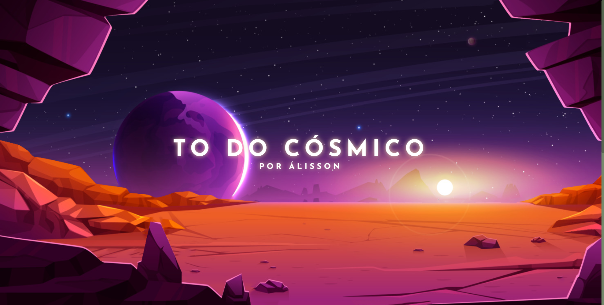
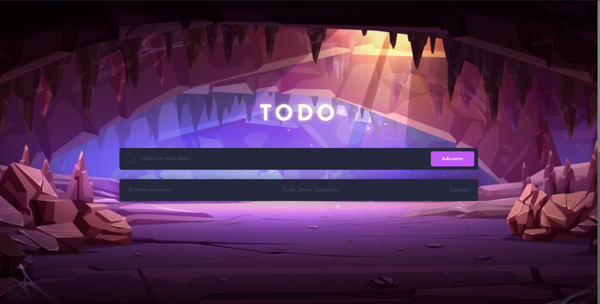
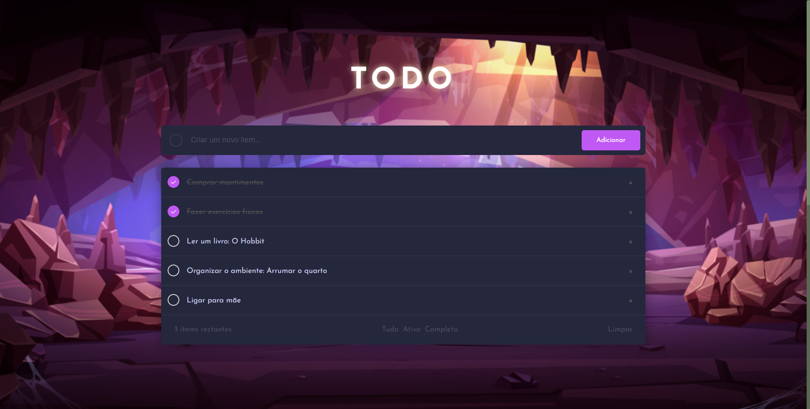

# Desafio Todo Cósmico:

Repositório para aprimorar algumas técnicas de HTML, CSS e JavaScript. Seu objeto é produzir um todo list, além disso foi adicionado um efeito de parallax para complementar a experiência e diferência-lo de outros todos. Devidamente irei referenciar cada uma das ideias, imagens e autores utilizados.

# Desenvolvimento contínuo:

Alguns ajustes podem vir, porém creio que esse projeto foi terminado. O qual será adicionado ao portfólio eventualmente.

### Screenshot

# Recursos úteis:

- [Building a TO DO LIST - Clever Programmer](https://www.youtube.com/watch?v=KA_8eOIsjn4)
- [How To Create To-DO App - Easy Tutorials](https://www.youtube.com/watch?v=G0jO8kUrg-I)
- [Create Parallax HTML CSS JavaScript - WebDesign Master](https://www.youtube.com/watch?v=F5ZKI-g-_qo)
- [Red Planet Background](https://www.vecteezy.com/free-vector/mars)
- [Cave With Sunlight](https://www.vecteezy.com/free-vector/mars)
- [Favicon](https://github.com/twitter/twemoji/blob/master/assets/svg/1f47e.svg)
- [ChatGPT](https://chat.openai.com/)

# Autor

- Github - [@fty57](https://github.com/fty57)

# Conhecimentos

O efeito de parallax sempre me surpreendeu desde os aplicados em jogos digitais, agora tentar colocar em um projeto é bem desafiador e divertido. Além disso, pude usar localStorage que não conhecia muito, achei bem interessante para simular alguns efeitos desejados.
